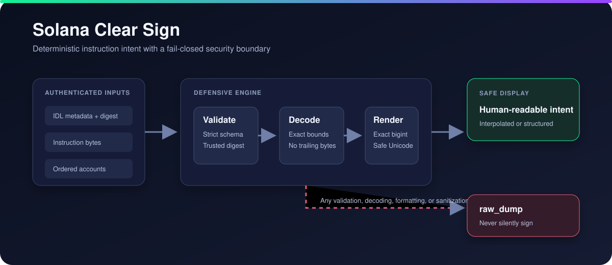
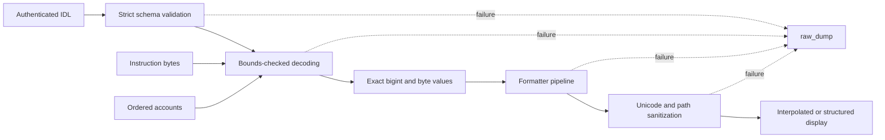

# Solana Clear Sign

[](https://github.com/mjordan237/solana-clear-sign/actions/workflows/ci.yml)
[](LICENSE)
[](package.json)

An experimental defensive TypeScript implementation of an instruction-level profile inspired by the draft [sRFC 39: Solana Clear Sign](https://github.com/solana-foundation/SRFCs/discussions/4). It validates enriched IDLs, decodes Borsh-compatible instruction data, formats fields without floating-point arithmetic, and fails closed to a visible `raw_dump` whenever metadata or bytes cannot be trusted.



> sRFC 39 is currently a draft. This repository tests a security-focused subset with amount, flat-struct, unit, string, datetime, duration, raw-number, BoundedSlice, and SizedSlice support. It is not yet wire-compatible with every display node in the evolving draft. Consumers must authenticate the IDL and token metadata separately. A parser cannot detect a plausible but dishonest decimal value without a trusted registry.

## What this repository proves

| Question | Verifiable answer |
|---|---|
| Can instruction bytes be decoded without silent truncation? | The decoder requires exact discriminators, account counts, bounds, and byte consumption. |
| What happens when metadata is malformed? | Every parsing or rendering failure returns an explicit `raw_dump` result. |
| Can display labels hide Unicode controls? | Invisible controls, bidirectional overrides, and mixed-script confusables are rejected. |
| Can untrusted IDLs be blocked? | `decodeVerifiedInstruction` checks a canonical SHA-256 digest before decoding. |
| Can another implementation reuse the tests? | Valid and adversarial cases are stored as language-neutral JSON vectors. |
| Is the performance target automated? | CI asserts average decode latency below 1 ms. |

The implementation currently has 50 automated tests and 27 JSON vectors. The [specification profile](SPECIFICATION.md) separates implemented behavior from wallet responsibilities and draft-dependent work.

## Architecture



The safety boundary is `decodeInstruction`: it catches schema, decoding, formatting, and rendering failures and returns a hexadecimal raw view. The decoder requires an exact discriminator, exact account count, exact byte consumption, bounded dynamic lengths, valid option/boolean tags, and valid UTF-8.

## Install and use

```bash
npm install
npm run build
npm test
```

```ts
import { decodeInstruction } from "solana-clear-sign";

const idl = {
  name: "system",
  instructions: [{
    name: "transfer",
    discriminator: [2, 0, 0, 0],
    accounts: [{ name: "from" }, { name: "to" }],
    args: [{
      name: "lamports",
      type: "u64",
      display: { formatter: { kind: "amount", isNative: true } }
    }],
    display: {
      mode: "interpolated",
      template: "Transfer {lamports} to {to}"
    }
  }]
};

const result = decodeInstruction(
  idl,
  "transfer",
  Buffer.from("0200000000ca9a3b00000000", "hex"),
  ["Sender111", "Receiver111"]
);
// result.display === "Transfer 1 SOL to Receiver111"
```

Callers must check `result.mode`. A `raw_dump` result is intentionally not a clear-signing authorization and should require the wallet's explicit blind-signing flow.

## IDL linter

```bash
npm run build
node dist/cli/index.js --idl ./idl.json
```

The command exits `0` for a valid enriched IDL and `1` for JSON, schema, missing-display, dangerous-template, or formatter-combination errors.

## Compatibility status

This prototype deliberately uses a compact profile schema with `mode`, `template`, and `fields` properties. The current sRFC discussion uses a broader Codama-oriented display-node representation, including `intent`, `interpolatedIntent`, account display nodes, and contextual metadata resolution. Those representations are not interchangeable yet.

The implemented profile is useful for testing strict decoding, failure behavior, rendering safety, and reusable adversarial vectors. Full alignment with the final sRFC node representation, wallet integration, and account-state resolution remain explicit follow-on work rather than implied capabilities of this release.

## Implemented profile matrix

| sRFC 39 profile requirement | Implementation | Tests/vectors |
|---|---|---|
| Instruction-only IDL extension | `src/types/srfc39.ts` | `schema.test.ts` |
| Interpolated and fallback display | `src/renderer/index.ts` | valid vectors |
| Amount formatting, native SOL | `src/formatters/amount.ts` | formatter + transfer vectors |
| Flat nested structs | `src/formatters/struct.ts` | Anchor nested-struct vector |
| Unit scaling | `src/formatters/unit.ts` | formatter + bps vector |
| ASCII/UTF-8/hex/base58/base64, BoundedSlice, SizedSlice | `src/formatters/string.ts` | formatter + string vectors |
| Unix epoch/ticks | `src/formatters/datetime.ts` | datetime vector |
| Duration and raw numeric display | `src/formatters/duration.ts`, `raw.ts` | formatter tests |
| Authenticated IDL digest policy | `src/provenance.ts` | provenance tests |
| Unicode controls and mixed-script spoofing | `src/security.ts` | adversarial corpus |
| Safe interpolation paths | schema + renderer | adversarial corpus |
| Exact, bounds-checked unpacking | `src/parser/decoder.ts` | decoder + adversarial corpus |
| Exception-safe raw fallback | `src/parser/decoder.ts` | every adversarial vector |
| CLI validation | `src/cli/index.ts` | schema tests and CI build |
| Decode latency below 1 ms average | decoder | `benchmark.test.ts` |

The JSON corpus contains real-world-shaped System, SPL Token, Stake, Anchor, and Token-2022 cases plus malformed metadata, spoofing strings, unsafe paths, truncation, overflow, and conflicting flags. All integers remain `bigint` through formatting; no division or IEEE-754 conversion is used for amounts.

## Trust and security model

- Authenticate IDLs and any token metadata before using them for clear signing.
- Treat `raw_dump` as a failure to establish human-readable intent, never as approval.
- The mixed-script rule deliberately rejects Latin/Cyrillic and Latin/Greek labels. This may reject legitimate multilingual labels; fail-closed behavior is intentional.
- Dynamic byte/string/vector lengths are capped at 1 Mi elements before allocation.
- This library decodes instruction payloads. It does not validate transaction signatures, program ownership, or account state.

See [SECURITY.md](SECURITY.md) for the reporting process and precise trust boundary.

## Public-goods alignment

The package is Apache-2.0 licensed, vendor-neutral, deterministic, and ships its machine-readable conformance corpus. Wallet, hardware, SDK, and program teams can reuse the vectors independently, compare implementations, and extend the profile as the draft advances.

## Development

```bash
npm run lint
npm run build
npm test
npm run bench
```

CI runs type checking, compilation, tests, coverage, and the benchmark on Node 18 and Node 20.
