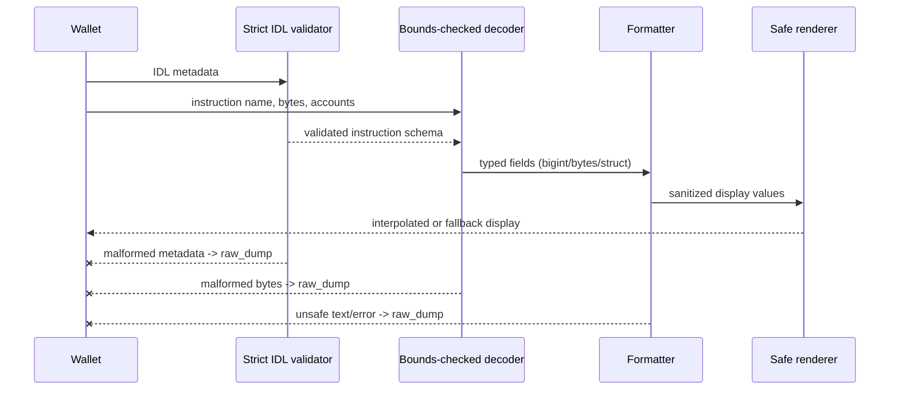

# Solana Clear Sign

A defensive TypeScript reference implementation of the instruction-level profile in the draft [sRFC 39: Solana Clear Sign](https://github.com/solana-foundation/SRFCs/discussions/4). It validates enriched IDLs, decodes Borsh-compatible instruction data, formats fields without floating-point arithmetic, and fails closed to a visible `raw_dump` whenever metadata or bytes cannot be trusted.

> sRFC 39 is currently a draft. This repository implements an instruction-level conformance profile with amount, flat-struct, unit, string, datetime, duration, raw-number, BoundedSlice, and SizedSlice support. Consumers must authenticate the IDL and token metadata separately. A parser cannot detect a plausible but dishonest decimal value without a trusted registry.

## Architecture



The safety boundary is `decodeInstruction`: it catches schema, decoding, formatting, and rendering failures and returns a hexadecimal raw view. The decoder requires an exact discriminator, exact account count, exact byte consumption, bounded dynamic lengths, valid option/boolean tags, and valid UTF-8.

## Install and use

```bash
npm install
npm run build
npm test
```

```ts
import { decodeInstruction } from "solana-clear-sign";

const idl = {
  name: "system",
  instructions: [{
    name: "transfer",
    discriminator: [2, 0, 0, 0],
    accounts: [{ name: "from" }, { name: "to" }],
    args: [{
      name: "lamports",
      type: "u64",
      display: { formatter: { kind: "amount", isNative: true } }
    }],
    display: {
      mode: "interpolated",
      template: "Transfer {lamports} to {to}"
    }
  }]
};

const result = decodeInstruction(
  idl,
  "transfer",
  Buffer.from("0200000000ca9a3b00000000", "hex"),
  ["Sender111", "Receiver111"]
);
// result.display === "Transfer 1 SOL to Receiver111"
```

Callers must check `result.mode`. A `raw_dump` result is intentionally not a clear-signing authorization and should require the wallet's explicit blind-signing flow.

## IDL linter

```bash
npx solana-clear-sign-lint --idl ./idl.json
```

The command exits `0` for a valid enriched IDL and `1` for JSON, schema, missing-display, dangerous-template, or formatter-combination errors.

## Conformance matrix

| sRFC 39 profile requirement | Implementation | Tests/vectors |
|---|---|---|
| Instruction-only IDL extension | `src/types/srfc39.ts` | `schema.test.ts` |
| Interpolated and fallback display | `src/renderer/index.ts` | valid vectors |
| Amount formatting, native SOL | `src/formatters/amount.ts` | formatter + transfer vectors |
| Flat nested structs | `src/formatters/struct.ts` | Anchor nested-struct vector |
| Unit scaling | `src/formatters/unit.ts` | formatter + bps vector |
| ASCII/UTF-8/hex/base58/base64, BoundedSlice, SizedSlice | `src/formatters/string.ts` | formatter + string vectors |
| Unix epoch/ticks | `src/formatters/datetime.ts` | datetime vector |
| Duration and raw numeric display | `src/formatters/duration.ts`, `raw.ts` | formatter tests |
| Authenticated IDL digest policy | `src/provenance.ts` | provenance tests |
| Unicode controls and mixed-script spoofing | `src/security.ts` | adversarial corpus |
| Safe interpolation paths | schema + renderer | adversarial corpus |
| Exact, bounds-checked unpacking | `src/parser/decoder.ts` | decoder + adversarial corpus |
| Exception-safe raw fallback | `src/parser/decoder.ts` | every adversarial vector |
| CLI validation | `src/cli/index.ts` | schema tests and CI build |
| Decode latency below 1 ms average | decoder | `benchmark.test.ts` |

The JSON corpus contains real-world-shaped System, SPL Token, Stake, Anchor, and Token-2022 cases plus malformed metadata, spoofing strings, unsafe paths, truncation, overflow, and conflicting flags. All integers remain `bigint` through formatting; no division or IEEE-754 conversion is used for amounts.

## Trust and security model

- Authenticate IDLs and any token metadata before using them for clear signing.
- Treat `raw_dump` as a failure to establish human-readable intent, never as approval.
- The mixed-script rule deliberately rejects Latin/Cyrillic and Latin/Greek labels. This may reject legitimate multilingual labels; fail-closed behavior is intentional.
- Dynamic byte/string/vector lengths are capped at 1 Mi elements before allocation.
- This library decodes instruction payloads. It does not validate transaction signatures, program ownership, or account state.

## Public-goods alignment

The package is Apache-2.0 licensed, vendor-neutral, deterministic, and ships its machine-readable conformance corpus. Wallet, hardware, SDK, and program teams can reuse the vectors independently, compare implementations, and extend the profile as the draft advances.

## Development

```bash
npm run lint
npm run build
npm test
npm run bench
```

CI runs type checking, compilation, tests, coverage, and the benchmark on Node 18 and Node 20.
